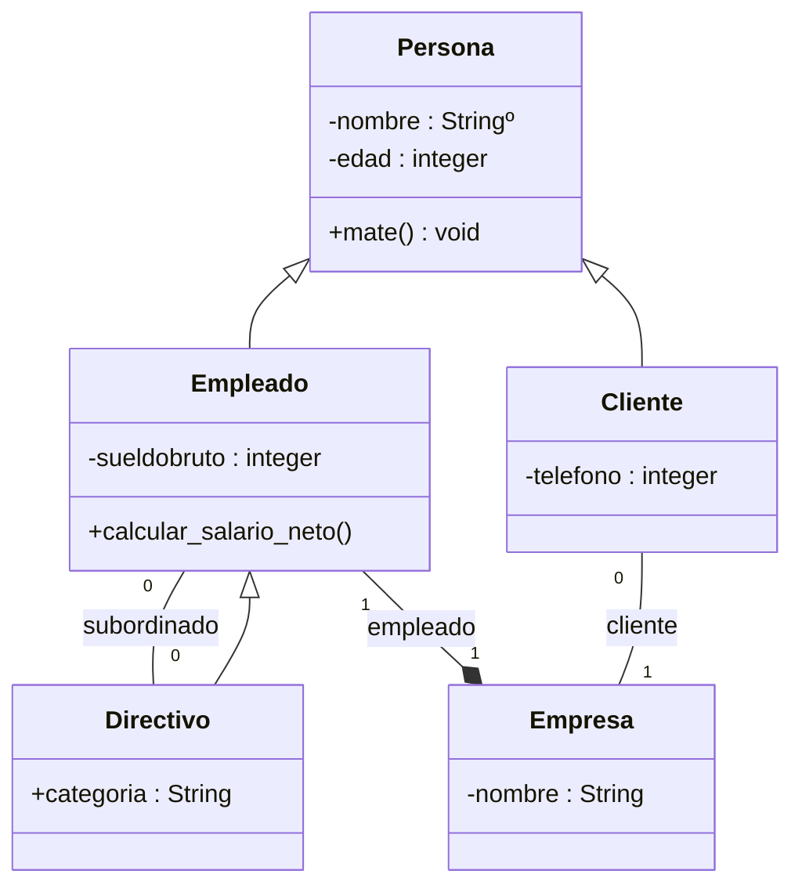

```mermaid
classDiagram
      Persona <|-- Empleado
      Persona <|-- Cliente
      Cliente "0"-- "1" Empresa : cliente
      Empleado <|-- Directivo
      Empleado "1" --* "1" Empresa : empleado
      Directivo "0" -- "0" Empleado : subordinado


      class Persona{
            -nombre : Stringº
            -edad : integer
            +mate() void
        }

      class Empleado{
          -sueldobruto : integer
          +calcular_salario_neto()
      }

      class Cliente{
          -telefono : integer
      }

      class Directivo{
          +categoria : String
      }
      class Empresa{
          -nombre : String
      }

    
```
  